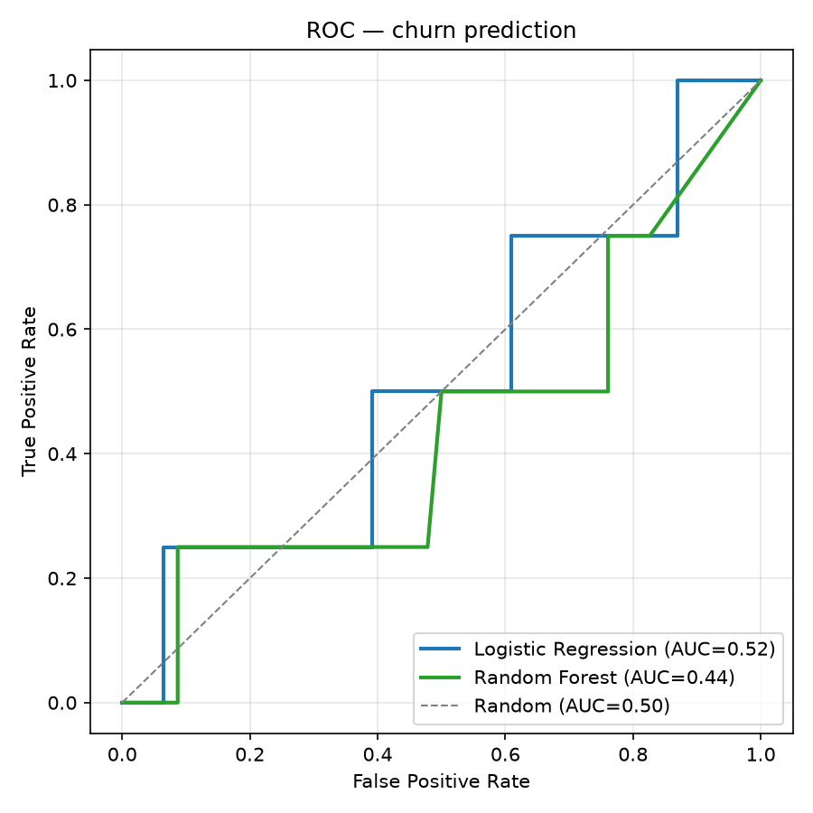
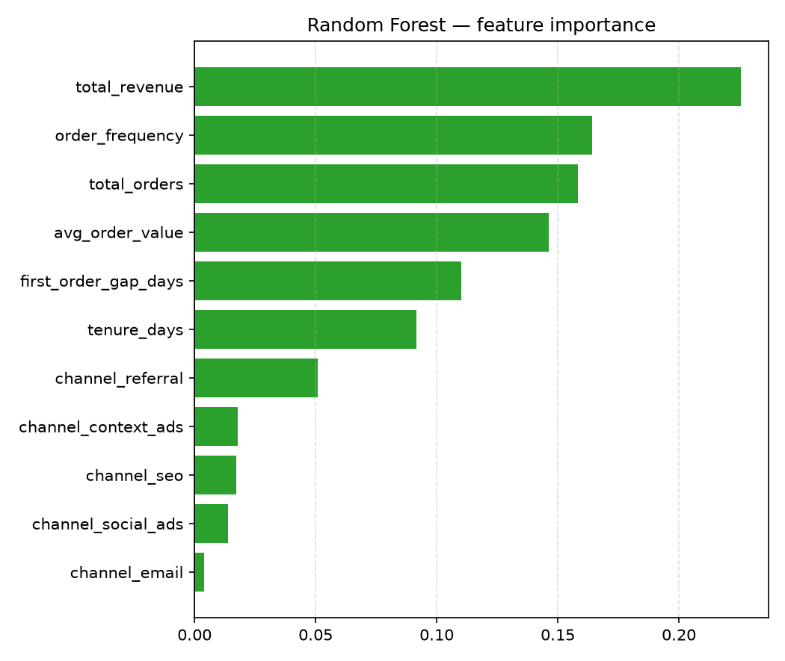
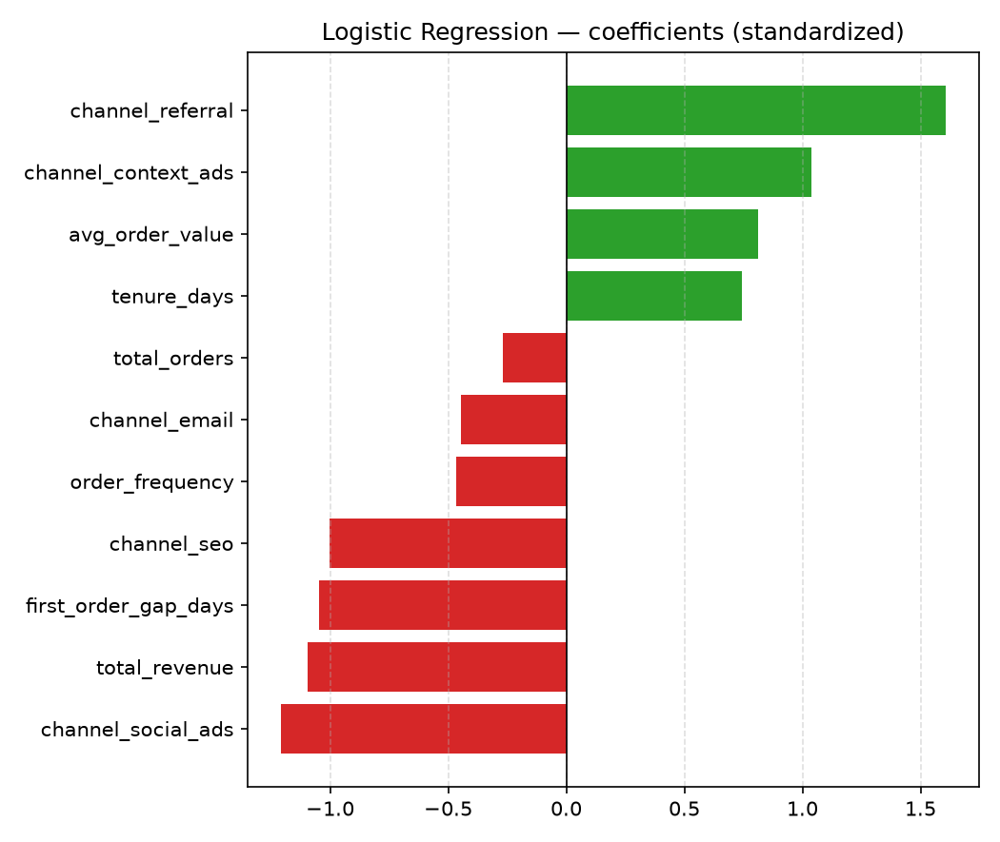

# Product & Marketing Analytics


Пет-проект уровня Data/Product Analyst: SQL-витрины и Python-визуализация поверх
staging-слоя, который готовит соседний ETL-репозиторий
[`etl-portfolio`](../etl-portfolio). Разделение осознанное: там — приём и
очистка сырых данных, здесь — их анализ и бизнес-интерпретация.

Три вопроса, на которые отвечает этот репозиторий:

1. Какие каналы привлечения окупаются (CAC/CPL/ROMI), а какие пора остановить?
2. Сколько в среднем приносит клиент к N-му заказу (LTV)?
3. Как быстро "отваливаются" клиенты после регистрации (cohort retention)?
4. Можно ли предсказать отток клиента по его поведению до того, как он ушёл?

## Стек

PostgreSQL (window functions, CTE), Python (pandas, matplotlib, scikit-learn), Jupyter.

## Структура

- `sql/marts.sql` — три VIEW поверх `stg_customers` / `stg_orders` / `stg_marketing_spend`
- `notebooks/analysis.ipynb` — выполненный ноутбук с графиками и интерпретацией (открывается прямо на GitHub)
- `src/analytics/visualization.py` — тестируемая функция построения ROMI-графика
- `ml/build_features.py` — customer-level датасет для churn-классификации (label + фичи)
- `ml/train_churn_model.py` — Logistic Regression / Random Forest, ROC-AUC, PR-AUC, feature importance
- `tests/` — pytest для `visualization.py` и `ml/build_features.py`

## Как запустить

Требует запущенный и наполненный `etl-portfolio` (см. его README) — эта база
и есть источник данных.

```
python -m venv .venv
.venv\Scripts\activate
pip install -r requirements.txt
cp .env.example .env   # указать пароль от того же etl_portfolio
psql -U postgres -d etl_portfolio -f sql/marts.sql
jupyter nbconvert --to notebook --execute --inplace notebooks/analysis.ipynb
python ml/build_features.py
python ml/train_churn_model.py
pytest
```

## Витрины (`sql/marts.sql`)

- **`mart_channel_economics`** — CAC, CPL, ROMI по каналу/месяцу + накопительный
  спенд/выручка через `SUM() OVER (PARTITION BY channel ORDER BY spend_month)`.
- **`mart_customer_ltv`** — накопительная выручка клиента и номер заказа через
  `ROW_NUMBER()` / `SUM() OVER (...ROWS BETWEEN UNBOUNDED PRECEDING AND CURRENT ROW)`,
  без единого `GROUP BY`.
- **`mart_cohort_retention`** — классический cohort-анализ: CTE считает размер
  когорты по месяцу регистрации, затем помесячную долю вернувшихся клиентов.

## Результаты на текущем датасете

Витрины посчитаны на реально сгенерированных и загруженных данных (200 клиентов,
~2000 заказов, 72 месяца×канала маркетингового спенда) — не придуманы вручную.

**ROMI по каналам за весь период** (доход того же месяца минус спенд, к спенду):

| channel | total spend | avg CPL | avg CAC | ROMI |
|---|---|---|---|---|
| referral | 639 | 11.6 | 23.7 | **+78.9** |
| seo | 3 007 | 15.1 | 68.3 | +22.0 |
| email | 647 | 5.8 | 38.1 | +19.4 |
| context_ads | 9 309 | 45.0 | 131.1 | +16.7 |
| social_ads | 7 540 | 33.5 | 183.9 | **+10.1** |

Вывод: `social_ads` и `context_ads` тянут больше всего бюджета при самом слабом
ROMI среди прибыльных каналов — первые кандидаты на пересмотр (см. график в
ноутбуке, где отдельные месяцы этих каналов уходят в отрицательный ROMI).

**LTV**: средняя накопительная выручка растёт с 508 у.е. к 1-му заказу до
~2 529 у.е. к 5-му (из 200 клиентов до 5-го заказа доходят 192) — повторные
заказы дают сопоставимую с первым заказом выручку, удержание так же важно,
как первичное привлечение.

**Retention**: в среднем по когортам ~59% клиентов оформляют повторный заказ в
тот же месяц регистрации, к 1-му месяцу проседает до ~47%, дальше колеблется
55-71% без устойчивого тренда на этом объёме данных.

Полные графики (ROMI bar chart, LTV-кривая, cohort heatmap) и интерпретация —
в [`notebooks/analysis.ipynb`](notebooks/analysis.ipynb).

## Ограничение методологии

`revenue_same_month` в `mart_channel_economics` считает выручку только за тот
же календарный месяц, что и маркетинговый спенд — это занижает ROMI каналов с
более длинным циклом принятия решения (типично для B2B/дорогих товаров).
Более честный расчёт использовал бы окно атрибуции (например, 60/90 дней)
вместо строгого календарного месяца — следующий шаг для этой витрины.

## Предиктивный ML: churn prediction (`ml/`)

Мост от описательной аналитики (LTV, cohort retention) к предиктивной:
бинарная классификация оттока клиента.

**Label.** Явного события "отписки" в данных нет, поэтому отток определён
поведенчески: клиент считается оттёкшим, если последний заказ старше 90 дней
относительно `cutoff = max(order_date)` в датасете. Проверено: все клиенты
зарегистрированы минимум за 90 дней до cutoff — цензурирования по времени
наблюдения нет (не засчитываем "свежих" клиентов в отток нечестно).

**Признаки** (`ml/build_features.py`, один ряд на клиента): `total_orders`,
`total_revenue`, `avg_order_value`, `tenure_days`, `first_order_gap_days`,
`order_frequency`, `channel`. `days_since_last_order` в датасет входит, но
**не** используется как фича — это то же поле, из которого построен label
(иначе — target leakage).

**Обучение** (`ml/train_churn_model.py`): stratified train/test split (75/25),
`class_weight="balanced"` в обеих моделях — на 200 клиентах отток случается в
8.5% случаев (17 из 200), без балансировки классификатор просто предсказывал
бы "не ушёл" всегда и получал 91.5% accuracy при нулевой пользе.

| Модель | ROC-AUC | PR-AUC |
|---|---|---|
| Logistic Regression | 0.52 | 0.13 |
| Random Forest | 0.44 | 0.11 |

ROC-кривые и важность признаков (RF `feature_importances_`, LR-коэффициенты
на стандартизированных фичах):





**Честный результат: AUC на уровне случайного угадывания — и это ожидаемо.**
`scripts/generate_data.py` (etl-portfolio) назначает `channel` клиенту и
частоту заказов случайно, без встроенного механизма "этот клиент похож на
тех, кто уходит" — в данных физически нет сигнала, который отличал бы
будущих отточных клиентов от активных. Модель, показывающая AUC≈0.5 на
данных без сигнала — это correct, не баг. Демонстрируется здесь не
"предсказательная сила на реальном бизнесе" (бизнеса нет, данные
синтетические), а сам workflow: honest train/test split, обработка
дисбаланса классов, набор метрик, интерпретация важности признаков — то,
что применяется к реальным данным без изменений. Дополнительное ограничение:
17 положительных примеров на весь датасет (4 в тестовой выборке) — при таком
n любая метрика шумит, доверительный интервал по ROC-AUC здесь шире, чем
разница между моделями.

## Дашборд

**Metabase (self-hosted, Docker)** — интерактивный дашборд поверх той же
Postgres, что использует пайплайн:

```
docker compose up -d
```

Открыть `http://localhost:3000`, при первом запуске добавить источник
данных Postgres: host `host.docker.internal`, port `5432`, database
`etl_portfolio` (те же креды, что в `.env`). После подключения витрины
`mart_channel_economics` / `mart_customer_ltv` / `mart_cohort_retention`
доступны Metabase напрямую как обычные таблицы.
